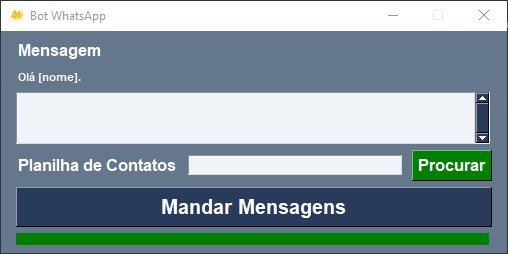

[ ](https://pyppeteer.github.io/pyppeteer/)  



## Instruções

Para executar:
- Escreva a mensagem, e insira uma planilha com duas colunas de Nomes e Números (com 19, sem traços ou espaços).
- Precisará entrar no WhatsApp Web com o celular, escaneando o QRCode quando solicitado.
- Após o bot executar o script, será gerado uma planilha com Nomes e Números de mensagens não enviadas.

**Utilizando [Python Pandas](https://pandas.pydata.org/), [OpenPyXL](https://openpyxl.readthedocs.io/en/stable/), [pyppeteer](https://github.com/pyppeteer/pyppeteer) e [PySimpleGui](https://pysimplegui.readthedocs.io/en/latest/).**
```
pip install pandas pyppeteer pysimplegui openpyxl
```

## Executável

Para criar um executável (.exe), use o [auto-py-to-exe](https://github.com/brentvollebregt/auto-py-to-exe) ou com o [pyinstaller](https://github.com/pyinstaller/pyinstaller), o comando:
```
pyinstaller --noconfirm --onefile --windowed --icon "icone.ico" --name "NomeDoExecutavel"  "botWhatsapp.py"
```

**Qualquer alteração no projeto é bem-vinda.**
